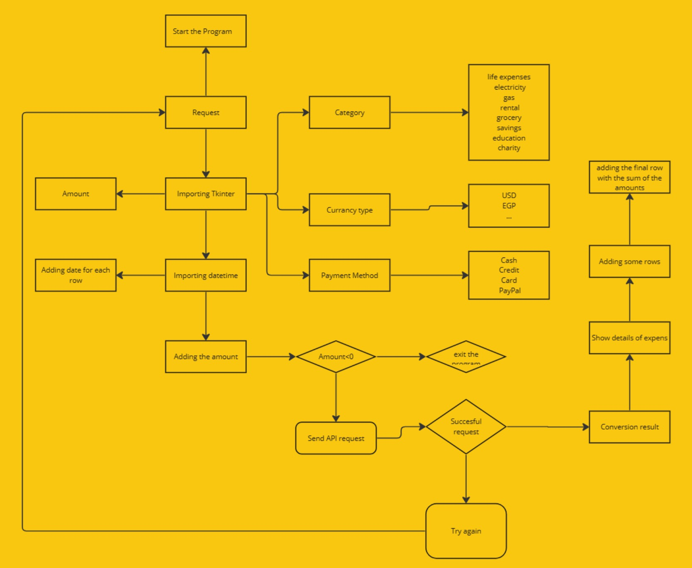
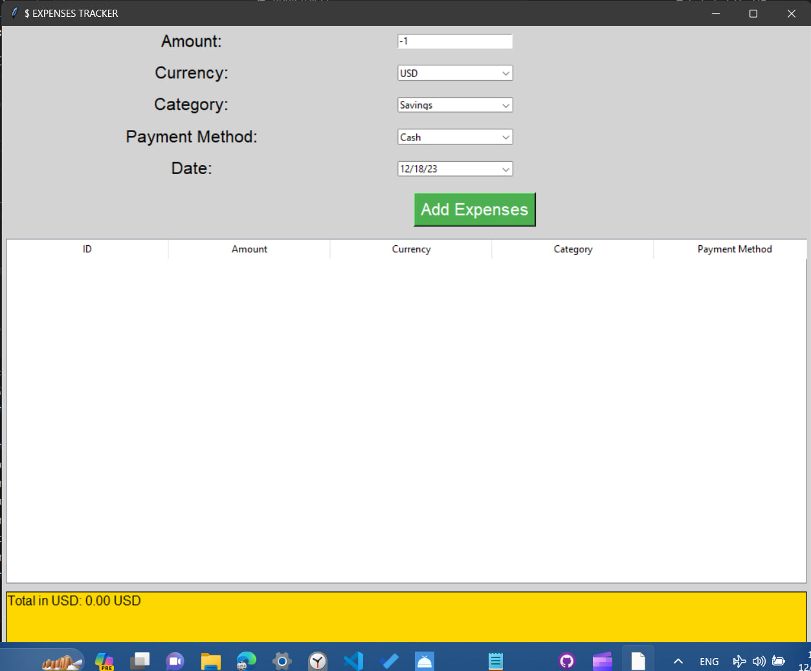
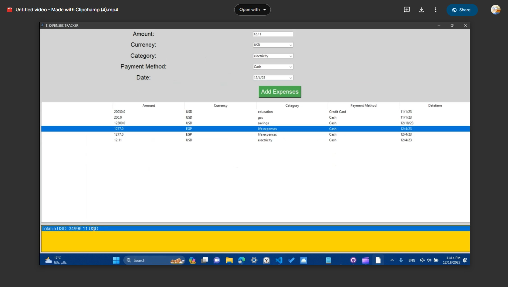

# Expenses-Tracker-App

## 🎥 [Watch the Demo Video](https://drive.google.com/file/d/1K4rk2ugNWGh5cNU8mT-bcdoqEypaeeH4/view?usp=sharing)

## Description:
Expenses Tracker App is a simple yet powerful tool to help you keep track of your expenses. With a user-friendly interface, it allows you to log your expenses in various currencies and provides a real-time total in USD.

## Features:
- Input fields for Amount, Currency, Category, Payment Method, and Date.
- Dynamic currency selection using Combobox.
- Treeview to display logged expenses with columns for Amount, Currency, Category, Payment Method, and Date.
- Real-time calculation of the total in USD.
- Stylish and responsive design for a seamless user experience.

## Instructions:
1. Enter the expense details in the input fields.
2. Click the "Add Expenses" button to log the expense.
3. The Treeview displays all logged expenses.
4. The total amount in USD is updated in real-time.

